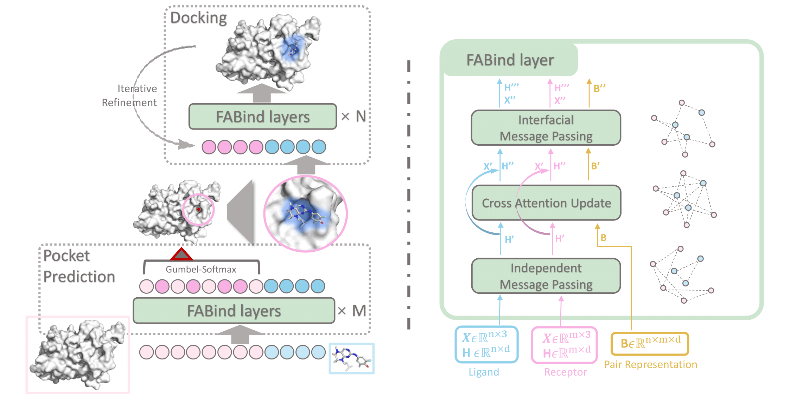

<h1 align="center">
FABind: Fast and Accurate Protein-Ligand Binding 🔥
</h1>

<div align="center">

[](https://arxiv.org/abs/2310.06763)
[](https://github.com/QizhiPei/FABind)
[](https://neurips.cc/virtual/2023/poster/71739)
[](https://github.com/QizhiPei/FABind/ckpt) 
[](https://zenodo.org/records/10021618)
</div>

## Overview
This repository contains the source code for *Neurips 2023* paper "[FABind: Fast and Accurate Protein-Ligand Binding](https://arxiv.org/abs/2310.06763)". FABind achieves accurate docking performance with high speed compared to recent baselines. If you have questions, don't hesitate to open an issue or ask me via <qizhipei@ruc.edu.cn>, Kaiyuan Gao <im_kai@hust.edu.cn>, or Lijun Wu via <lijuwu@microsoft.com>. We are happy to hear from you!



## News
**Oct 10 2023**: The trained FABind model and processed dataset are released!

**Oct 11 2023**: Initial commits. More codes, pre-trained model, and data are coming soon.

## Setup Environment
This is an example for how to set up a working conda environment to run the code. In this example, we have cuda version==11.3, and we install torch==1.12.0. To make sure the pyg packages are installed correctely, we directly install them from whl.

```shell
conda create --name fabind python=3.8
conda activate fabind
conda install pytorch==1.12.0 torchvision==0.13.0 torchaudio==0.12.0 cudatoolkit=11.3 -c pytorch
pip install https://data.pyg.org/whl/torch-1.12.0%2Bcu113/torch_cluster-1.6.0%2Bpt112cu113-cp38-cp38-linux_x86_64.whl
pip install https://data.pyg.org/whl/torch-1.12.0%2Bcu113/torch_scatter-2.1.0%2Bpt112cu113-cp38-cp38-linux_x86_64.whl
pip install https://data.pyg.org/whl/torch-1.12.0%2Bcu113/torch_sparse-0.6.15%2Bpt112cu113-cp38-cp38-linux_x86_64.whl 
pip install https://data.pyg.org/whl/torch-1.12.0%2Bcu113/torch_spline_conv-1.2.1%2Bpt112cu113-cp38-cp38-linux_x86_64.whl
pip install https://data.pyg.org/whl/torch-1.12.0%2Bcu113/pyg_lib-0.2.0%2Bpt112cu113-cp38-cp38-linux_x86_64.whl
pip install torch-geometric
pip install torchdrug==0.1.2 rdkit torchmetrics==0.10.2 tqdm mlcrate pyarrow accelerate Bio lmdb fair-esm tensorboard 
```

## Data
The PDBbind 2020 dataset can be download from http://www.pdbbind.org.cn. We then follow the same data processing as [TankBind](https://github.com/luwei0917/TankBind/blob/main/examples/construction_PDBbind_training_and_test_dataset.ipynb).

We also provided processed dataset on [zenodo](https://zenodo.org/records/10021618).
If you want to train FABind from scratch, or reproduce the FABind results, you can:
1. download dataset from [zenodo](https://zenodo.org/records/10021618)
2. unzip the `zip` file and place it into `data_path`

## Evaluation
```shell
data_path=path_to_your_downloaded_data
ckpt=path_to_your_downloaded_ckpt

python fabind/test_fabind.py \
    --batch_size 4 \
    --data-path $data_path \
    --resultFolder ./results \
    --exp-name test_exp \
    --ckpt $ckpt_path \
    --local-eval
```

## Inference on Custom Complexes
Coming soon...

## Re-training
```shell
data_path=path_to_your_downloaded_data

python -c "from accelerate.utils import write_basic_config; write_basic_config(mixed_precision='no')"
accelerate launch fabind/main_fabind.py \
    --batch_size 12 \
    -d 0 \
    -m 5 \
    --data-path $data_path \
    --label baseline \
    --addNoise 5 \
    --resultFolder ./results \
    --use-compound-com-cls \
    --total-epochs 500 \
    --exp-name train_tmp \
    --coord-loss-weight 1.0 \
    --pair-distance-loss-weight 1.0 \
    --pair-distance-distill-loss-weight 1.0 \
    --pocket-cls-loss-weight 1.0 \
    --pocket-distance-loss-weight 0.05 \
    --lr 5e-05 --lr-scheduler poly_decay \
    --distmap-pred mlp \
    --hidden-size 512 --pocket-pred-hidden-size 128 \
    --n-iter 8 --mean-layers 4 \
    --refine refine_coord \
    --coordinate-scale 5 \
    --geometry-reg-step-size 0.001 \
    --rm-layernorm --add-attn-pair-bias --explicit-pair-embed --add-cross-attn-layer \
    --noise-for-predicted-pocket 0 \
    --clip-grad \
    --random-n-iter \
    --pocket-idx-no-noise \
    --pocket-cls-loss-func bce \
    --use-esm2-feat
```

## About
### References
```
@misc{pei2023fabind,
      title={FABind: Fast and Accurate Protein-Ligand Binding}, 
      author={Qizhi Pei and Kaiyuan Gao and Lijun Wu and Jinhua Zhu and Yingce Xia and Shufang Xie and Tao Qin and Kun He and Tie-Yan Liu and Rui Yan},
      year={2023},
      eprint={2310.06763},
      archivePrefix={arXiv},
      primaryClass={cs.LG}
}
```

### Acknowledegments
We appreciate [EquiBind](https://github.com/HannesStark/EquiBind), [TankBind](https://github.com/luwei0917/TankBind), [E3Bind](https://openreview.net/forum?id=sO1QiAftQFv), [DiffDock](https://github.com/gcorso/DiffDock) and other related works for their open-sourced contributions.
